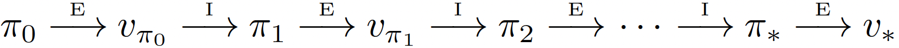
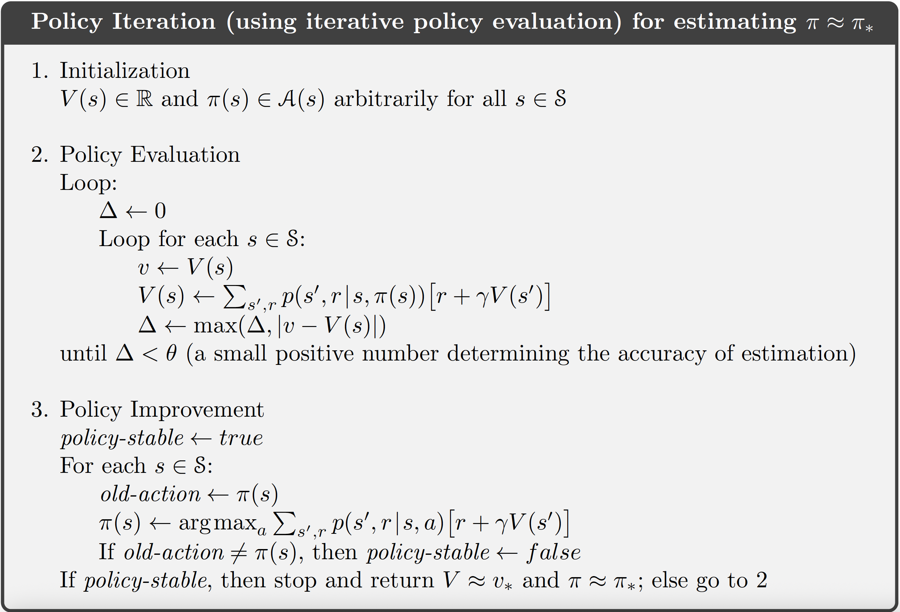

## Policy Iteration

**policy improvement*:** *The process of making a new policy that improves on an original policy, by making it greedy with respect to the value function of the original policy.

Once a policy, *π*, has been improved using v*π* to yield a better policy, *π’*, we can then
compute v*π’* and improve it again to yield an even better *π’’*. We can thus obtain a
sequence of monotonically improving policies and value functions:





Policy iteration often converges in surprisingly few iterations.

```python
import numpy as np

class PolicyIteration:
    def __init__(self, states, actions, transition_prob, rewards, gamma=0.99, theta=1e-8):
        """
        Parameters:
            states: List of states (or range(n_states))
            actions: List of actions (or range(n_actions))
            transition_prob: P[s, a, s'] = Pr(s' | s, a), shape (n_states, n_actions, n_states)
            rewards: R[s, a] = expected reward for taking action a in state s
            gamma: Discount factor
            theta: Threshold for convergence in policy evaluation
        """
        self.states = states
        self.actions = actions
        self.P = transition_prob
        self.R = rewards
        self.gamma = gamma
        self.theta = theta
        self.n_states = len(states)
        self.n_actions = len(actions)
        self.policy = np.zeros(self.n_states, dtype=int)  # Initial deterministic policy
        self.V = np.zeros(self.n_states)

    def policy_evaluation(self):
        while True:
            delta = 0
            for s in self.states:
                a = self.policy[s]
                v = self.V[s]
                self.V[s] = sum(self.P[s, a, s_prime] * (self.R[s, a] + self.gamma * self.V[s_prime])
                                for s_prime in self.states)
                delta = max(delta, abs(v - self.V[s]))
            if delta < self.theta:
                break

    def policy_improvement(self):
        policy_stable = True
        for s in self.states:
            old_action = self.policy[s]
            action_values = np.zeros(self.n_actions)
            for a in self.actions:
                action_values[a] = sum(self.P[s, a, s_prime] * (self.R[s, a] + self.gamma * self.V[s_prime])
                                       for s_prime in self.states)
            best_action = np.argmax(action_values)
            self.policy[s] = best_action
            if old_action != best_action:
                policy_stable = False
        return policy_stable

    def iterate(self):
        iteration = 0
        while True:
            self.policy_evaluation()
            policy_stable = self.policy_improvement()
            iteration += 1
            if policy_stable:
                print(f"Policy iteration converged after {iteration} iterations.")
                break
        return self.policy, self.V

# Example usage (on a dummy MDP)
if __name__ == "__main__":
    n_states = 4
    n_actions = 2
    states = range(n_states)
    actions = range(n_actions)

    # Example transition probabilities and rewards
    P = np.zeros((n_states, n_actions, n_states))
    R = np.zeros((n_states, n_actions))

    # Populate dummy transition and reward model
    for s in states:
        for a in actions:
            next_state = (s + a) % n_states
            P[s, a, next_state] = 1.0
            R[s, a] = -1.0 if s == n_states - 1 else 0.0

    pi = PolicyIteration(states, actions, P, R)
    optimal_policy, value_function = pi.iterate()
    print("Optimal Policy:", optimal_policy)
    print("Value Function:", value_function)
```