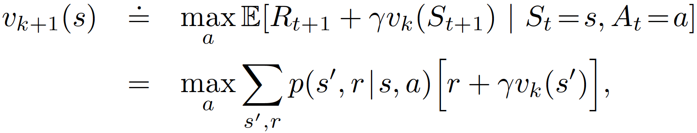

## Value Iteration

One drawback to policy iteration is that each of its iterations involves policy evaluation, which may itself be a protracted iterative computation requiring multiple sweeps through the state set. If policy evaluation is done iteratively, then convergence exactly to vπ occurs only in the limit. Must we wait for exact convergence, or can we stop short of that?

In fact, the policy evaluation step of policy iteration can be truncated in several ways without losing the convergence guarantees of policy iteration. One important special case is **when policy evaluation is stopped after just one sweep** (one update of each state). This algorithm is called ***value iteration***. It can be written as a particularly simple update operation that combines the policy improvement and truncated policy evaluation steps:



The difference:

- **Policy Iteration**
    
    Alternates between **evaluating** a policy and **improving** it:
    
    - Evaluate the current policy to get the value function.
    - Improve the policy using the value function.
    - Repeat until the policy is stable (doesn’t change).
- **Value Iteration**
    
    Focuses solely on **improving the value function**, and extracts the policy at the end:
    
    - Repeatedly apply the **Bellman optimality operator** to update the value function.
    - Once converged, derive the greedy policy from the final value function.

```python
import numpy as np

class ValueIteration:
    def __init__(self, states, actions, transition_prob, rewards, gamma=0.99, theta=1e-8):
        """
        Parameters:
            states: list or range of states
            actions: list or range of actions
            transition_prob: P[s, a, s'] = Pr(s' | s, a), shape (n_states, n_actions, n_states)
            rewards: R[s, a] = expected immediate reward for (s, a)
            gamma: Discount factor
            theta: Convergence threshold for value function
        """
        self.states = states
        self.actions = actions
        self.P = transition_prob
        self.R = rewards
        self.gamma = gamma
        self.theta = theta
        self.n_states = len(states)
        self.n_actions = len(actions)
        self.V = np.zeros(self.n_states)
        self.policy = np.zeros(self.n_states, dtype=int)

    def iterate(self):
        iteration = 0
        while True:
            delta = 0
            for s in self.states:
                v = self.V[s]
                action_values = np.zeros(self.n_actions)
                for a in self.actions:
                    action_values[a] = sum(self.P[s, a, s_prime] * (self.R[s, a] + self.gamma * self.V[s_prime])
                                           for s_prime in self.states)
                self.V[s] = np.max(action_values)
                delta = max(delta, abs(v - self.V[s]))
            iteration += 1
            if delta < self.theta:
                print(f"Value iteration converged after {iteration} iterations.")
                break

        # Derive policy from the optimal value function
        for s in self.states:
            action_values = np.zeros(self.n_actions)
            for a in self.actions:
                action_values[a] = sum(self.P[s, a, s_prime] * (self.R[s, a] + self.gamma * self.V[s_prime])
                                       for s_prime in self.states)
            self.policy[s] = np.argmax(action_values)

        return self.policy, self.V

# Example usage (on a dummy MDP)
if __name__ == "__main__":
    n_states = 4
    n_actions = 2
    states = range(n_states)
    actions = range(n_actions)

    # Dummy transition probabilities and rewards
    P = np.zeros((n_states, n_actions, n_states))
    R = np.zeros((n_states, n_actions))

    for s in states:
        for a in actions:
            next_state = (s + a) % n_states
            P[s, a, next_state] = 1.0
            R[s, a] = -1.0 if s == n_states - 1 else 0.0

    vi = ValueIteration(states, actions, P, R)
    optimal_policy, value_function = vi.iterate()
    print("Optimal Policy:", optimal_policy)
    print("Value Function:", value_function)
```
