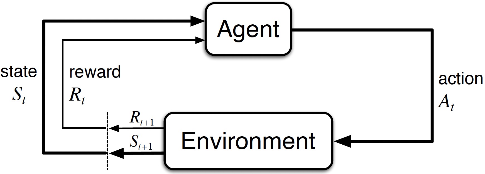
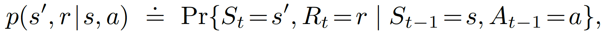
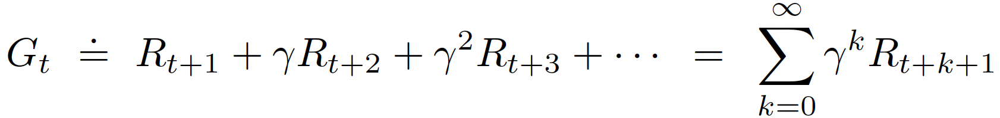
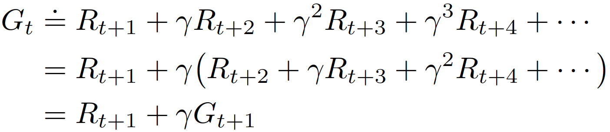

# Finite Markov Decision Processes

## The Agent–Environment Interface

**MDP**s are meant to be a straightforward framing of the problem of learning from interaction to achieve a goal. The learner and decision maker is called the ***agent (controller)*. The thing it interacts with, comprising everything outside the agent, is called the*** environment *(***controlled system/plant*). These interact continually, the agent selecting** *actions* (*control signal*) and the environment responding to these actions and presenting new situations to the agent. The environment also gives rise to ***reward**s*, special numerical values that the agent seeks to maximize over time through its choice of actions.

At each time step t, the agent receives some representation of the environment’s **state**, and on that basis selects an action. One time step later, in part as a consequence of its action, the agent receives a numerical reward, Rt+1, and finds itself in a new state, St+1. The MDP and agent together thereby give rise to a sequence or ***trajectory*** that begins like this: S0, A0, R1, S1, A1, R2, S2, A2, R3, . . .

In a finite MDP, the sets of states, actions, and rewards (S, A, and R) all have a finite number of elements. In this case, the random variables Rt and St have well-defined discrete probability distributions dependent only on the preceding state and action.

The function p defines the ***dynamics*** of the MDP.

The probability of each possible value for St and Rt depends only on the immediately preceding state and action, St−1 and At−1, and, given them, not at all on earlier states and actions. The state must include information about all aspects of the past agent–environment interaction that make a difference for the future. If it does, then the state is said to have the *Markov property*.

## Goals and Rewards

***reward hypothesis***: All of what we mean by goals and purposes can be well thought of as the **maximization of the expected value of the cumulative sum of a received scalar signal (called reward)**.

It is thus critical that the rewards we set up truly indicate what we want accomplished. In particular, the reward signal is not the place to impart to the agent prior knowledge about how to achieve what we want it to do (Better places for imparting this kind of prior knowledge are the initial policy or initial value function, or in influences on these). For example, a chess-playing agent should be rewarded only for actually winning, not for achieving subgoals such as taking its opponent’s pieces or gaining control of the center of the board. If achieving these sorts of subgoals were rewarded, then the agent might find a way to achieve them without achieving the real goal. The reward signal is your way of communicating to the robot ***what*** you want it to achieve, **NOT* how*** you want it achieved.

## Returns and Episodes

## Policies and Value Functions

Almost all reinforcement learning algorithms involve estimating value functions—functions of states (or of state–action pairs) that estimate how good it is for the agent to be in a given state (or how good it is to perform a given action in a given state). The notion of “how good” here is defined in terms of future rewards that can be expected, or, to be precise, in terms of expected return. Of course, the rewards the agent can expect to receive in the future depend on what actions it will take. Accordingly, value functions are defined with respect to particular ways of acting, called policies. 

Formally, a policy is a mapping from states to probabilities of selecting each possible action.

The value function of a state s under a policy ***π***, denoted vπ(s), is the expected return
when starting in s and following ***π*** thereafter. For MDPs, we can define vπ formally by

$$
v_{\pi}(s)\doteq\mathbb{E}_{\pi}\!\left[G_t \mid S_t=s\right]=\mathbb{E}_{\pi}\!\left[\sum_{k=0}^{\infty}\gamma^k R_{t+k+1}\mid S_t=s\right],\quad \forall s\in\mathcal{S}
$$

Note that the value of the terminal state, if any, is always zero. We call the function v*π* the *state-value function for policy π.*

Similarly, we define the value of taking action a in state s under a policy ***π***, denoted qπ(s, a), as the expected return starting from s, taking the action a, and thereafter following policy π:

$$
q_{\pi}(s,a)\doteq \mathbb{E}_{\pi}\!\left[G_t \mid S_t=s,\ A_t=a\right]=\mathbb{E}_{\pi}\!\left[\sum_{k=0}^{\infty}\gamma^k R_{t+k+1}\mid S_t=s,\ A_t=a\right]
$$

We call qπ the *action-value function* *for policy π*.

The value functions vπ and qπ can be estimated from experience. For example, if an agent follows policy π and maintains an average, for each state encountered, of the actual returns that have followed that state, then the average will converge to the state’s value, vπ(s), as the number of times that state is encountered approaches infinity. If separate averages are kept for each action taken in each state, then these averages will similarly converge to the action values, qπ(s, a). We call estimation methods of this kind Monte Carlo methods because they involve averaging over many random samples of actual returns. Of course, if there are very many states, then it may not be practical to keep separate averages for each state individually. Instead, the agent would have to maintain vπ and qπ as parameterized functions (with fewer parameters than states) and adjust the parameters to better match the observed returns. This can also produce accurate estimates, although much depends on the nature of the parameterized function approximator.

A fundamental property of value functions used throughout reinforcement learning and dynamic programming is that they satisfy recursive relationships. For any policy π and any state s, the
following consistency condition holds between the value of s and the value of its possible
successor state, ***Bellman equation for vπ:***

$$
\begin{aligned}v_{\pi}(s)&\doteq \mathbb{E}_{\pi}[G_t \mid S_t=s] \\&= \mathbb{E}_{\pi}[R_{t+1}+\gamma G_{t+1}\mid S_t=s] \\&= \sum_a \pi(a\mid s)\sum_{s'}\sum_r p(s',r\mid s,a)\left[r+\gamma\mathbb{E}_{\pi}[G_{t+1}\mid S_{t+1}=s']\right] \\&= \sum_a \pi(a\mid s)\sum_{s',r} p(s',r\mid s,a)\left[r+\gamma v_{\pi}(s')\right], \quad \forall s\in\mathcal{S}\end{aligned}
$$

Note how the final expression can be read easily as an expected value. It is really a sum over all values of the three variables, a, s0, and r. For each triple, we compute its probability, *π*(a|s)p(s0, r|s, a), weight the quantity in brackets by that probability, then sum over all possibilities to get an expected value.

## Optimal Policies and Optimal Value Functions

For finite MDPs, we can precisely define an optimal policy. Value functions define a partial ordering over policies. A policy is defined to be better than or equal to policy $v_{\pi}$ if its expected return is greater than or equal to that of policy vπ for all states. There is always at least one policy that is better than or equal to all other policies. This is an ***optimal policy (***π****).***

Although there may be more than one, we denote all the optimal policies by π*. They share the same state-value function for all states, called the optimal state-value function, denoted v*, and defined as

$$
v_*(s) \doteq \max_{\pi} v_{\pi}(s)
$$

They also share the same optimal *action-value function* for all states and actions, denoted q*, and defined as:

$$
q_*(s,a) \doteq \max_{\pi} q_{\pi}(s,a)
$$

For the state–action pair (s, a), this function gives the expected return for **taking action a in state s and thereafter following an optimal policy**. Thus, we can write $q*$ in terms of v* as follows:

$$
q_*(s,a) = \mathbb{E}[R_{t+1} + \gamma v_*(S_{t+1}) | S_t=s, A_t=a]
$$

The ***Bellman optimality equation*** expresses the fact that the value of a state under an optimal policy must equal the expected return for the best action from that state:

$$
\begin{aligned}v_{*}(s)&= \max_{a\in\mathcal{A}(s)} q_{\pi_*}(s,a) \\&= \max_a \mathbb{E}_{\pi_*}[G_t \mid S_t=s,\ A_t=a] \\&= \max_a \mathbb{E}_{\pi_*}[R_{t+1}+\gamma G_{t+1}\mid S_t=s,\ A_t=a] \\&= \max_a \mathbb{E}[R_{t+1}+\gamma v_{*}(S_{t+1})\mid S_t=s,\ A_t=a] \\&= \max_a \sum_{s',r} p(s',r\mid s,a)\left[r+\gamma v_{*}(s')\right].\end{aligned}
$$

The Bellman optimality equation for q* is:

$$
\begin{aligned}q_{*}(s,a)&= \mathbb{E}\left[R_{t+1}+\gamma \max_{a'} q_{*}(S_{t+1},a') \mid S_t=s,\ A_t=a\right] \\&= \sum_{s',r} p(s',r\mid s,a)\left[r+\gamma \max_{a'} q_{*}(s',a')\right].\end{aligned}
$$

For finite MDPs, the Bellman optimality equation for vπ has a unique solution independent of the policy (*i.e., the Bellman optimality equation directly defines the value function for the optimal policy, not any specific policy. Solving the Bellman expectation equation requires you to already know the policy, but solving the Bellman optimality equation allows you to find the value of the optimal policy without knowing the policy in advance*. It's a fixed-point equation for the best possible outcome, regardless of how an agent might act under any suboptimal policy. The Bellman optimality equation is actually a system of equations, one for each state, so if there are n states, then there are n equations in n unknowns. Because each state's optimal value depends on the values of successor states via the Bellman equation. If the dynamics p of the environment are known, the system is fully specified, then in principle one can solve this system of equations for v* using any one of a variety of methods for solving systems of nonlinear equations (e.g., value iteration, policy iteration, or nonlinear solvers). One can solve a related set of equations for q*. Another way of saying this is that any policy that is greedy with respect to the optimal evaluation function v* is an optimal policy.

Explicitly solving the Bellman optimality equation provides one route to finding an optimal policy, and thus to solving the reinforcement learning problem. However, this solution is rarely directly useful. It is akin to an exhaustive search, looking ahead at all possibilities, computing their probabilities of occurrence and their desirabilities in terms of expected rewards. **This solution relies on at least three assumptions that are rarely true in practice: (1) we accurately know the dynamics of the environment; (2) we have enough computational resources to complete the computation of the solution; and (3) the Markov property (*The state must include information about all aspects of the past agent–environment interaction that make a difference for the future*)**. In reinforcement learning, one typically has to settle for approximate solutions.

Many different decision-making methods can be viewed as ways of approximately solving the Bellman optimality equation. For example, heuristic search methods can be viewed as expanding the right-hand side of the [*Bellman optimality equation*](https://www.notion.so/Summary-Reinforcement-Learning-An-Introduction-2nd-Edition-Richard-Sutton-and-Andrew-Barto-1fb8e9353d4a80419b75e076b8b2fb7c?pvs=21) several times, up to some depth, forming a “tree” of possibilities, and then using a heuristic evaluation function to approximate v* at the “leaf” nodes. (Heuristic search methods such as A* are almost always based on the episodic case.) The methods of dynamic programming can be related even more closely to the Bellman optimality equation. Many reinforcement learning methods can be clearly understood as approximately solving the Bellman optimality equation, using actual experienced transitions in place of knowledge of the expected transitions.

