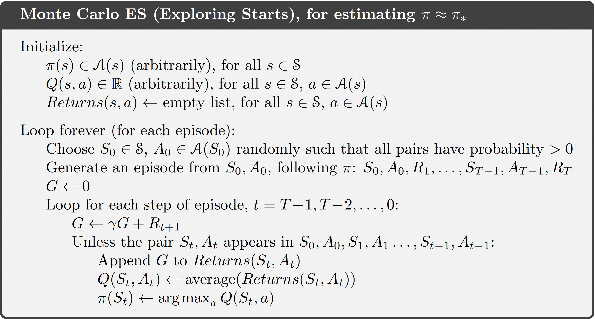

# Monte Carlo Methods

We consider our first learning methods for estimating value functions and discovering optimal policies. Here, **unlike in Dynamic Programming, we do not assume complete knowledge of the environment**. Monte Carlo methods require only experience—sample sequences of states, actions, and rewards from actual or simulated interaction with an environment. Learning from actual experience is striking because it requires no prior knowledge of the environment’s dynamics, yet can still attain optimal behavior. Learning from simulated experience is also powerful. Although a model is required, the model need only generate sample transitions, not the complete probability distributions of all possible transitions that is required for dynamic programming (DP). In surprisingly many cases it is easy to generate experience sampled according to the desired probability distributions, but infeasible to obtain the distributions in explicit form.

Monte Carlo methods are ways of solving the reinforcement learning problem based on averaging sample returns. To ensure that well-defined returns are available, here we define Monte Carlo methods **only for episodic tasks**. That is, we assume experience is divided into episodes, and that all episodes eventually terminate no matter what actions are selected. Only on the completion of an episode are value estimates and policies changed. Monte Carlo methods can thus be incremental in **an episode-by-episode sense, but not in a step-by-step (online) sense**. The term “Monte Carlo” is often used more broadly for any estimation method whose operation involves a significant random component. Here we use it specifically for methods based on averaging **complete returns** (as opposed to methods that learn from partial returns, considered in the next chapter).

We adapt the idea of general policy iteration (GPI) developed for DP. Whereas there we computed value functions from knowledge of the MDP, here we learn value functions from sample returns with the MDP. The value functions and corresponding policies still interact to attain optimality in essentially the same way (GPI). As in the DP, first we consider the prediction problem (the computation of vπ and qπ for a fixed arbitrary policy π) then policy improvement, and, finally, the control problem and its solution by GPI. Each of these ideas taken from DP is extended to the Monte Carlo case in which only sample experience is available.

## Monte Carlo Prediction

We begin by considering Monte Carlo methods for learning the state-value function for a given policy. Recall that the value of a state is the expected return—expected cumulative future discounted reward—starting from that state. An obvious way to estimate it from experience, then, is simply to average the returns observed after visits to that state. As more returns are observed, the average should converge to the expected value. This idea
underlies all Monte Carlo methods. The first-visit MC method estimates $v_{\pi}(s)$ as the average of the returns following first visits to s, whereas the every-visit MC method averages the returns following all visits to s. These two Monte Carlo (MC) methods are very similar but have slightly different theoretical properties. Both first-visit MC and vevery-visit MC converge to $v_{\pi}(s)$ as the number of visits (or first visits) to s goes to infinity. This is easy to see for the case of first-visit MC. In this case each return is an independent, identically distributed estimate of $v_{\pi}(s)$ with finite variance. By the law of large numbers the sequence of averages of these estimates converges to their expected value. Each average is itself an unbiased estimate, and the standard deviation of its error falls as $1/\sqrt{n}$, where $n$ is the number of returns averaged.

Although we have complete knowledge of the environment in the black-jack task, it would not be easy to apply DP methods to compute the value function. DP methods require the distribution of next events—in particular, they require the environments dynamics. In contrast, generating the sample games required by Monte Carlo methods is easy. This is the case surprisingly often; the ability of Monte Carlo methods to work with sample episodes alone can be a significant advantage even when one has complete knowledge of the environment’s dynamics.

An important fact about Monte Carlo methods is that the estimates for each state are independent. The estimate for one state does not build upon the estimate of any other state, as is the case in DP. In other words, Monte Carlo methods do not bootstrap as we defined it in the previous chapter. In particular, note that the computational expense of estimating the value of a single state is independent of the number of states. This can make Monte Carlo methods particularly attractive when one requires the value of only one or a subset of states. One can generate many sample episodes starting from the states of interest, averaging returns from only these states, ignoring all others. This is a third advantage Monte Carlo methods can have over DP methods

## Monte Carlo Estimation of Action Values

If a model is not available, then it is particularly useful to estimate action values (the values of state–action pairs) rather than state values. With a model, state values alone are sufficient to determine a policy; one simply looks ahead one step and chooses whichever action leads to the best combination of reward and next state, as we did in the chapter on DP. Without a model, however, state values alone are not sufficient. One must explicitly estimate the value of each action in order for the values to be useful in suggesting a policy. Thus, one of our primary goals for Monte Carlo methods is to estimate $q*$. To achieve this, we first consider the policy evaluation problem for action values.

The policy evaluation problem for action values is to **estimate­** $q_{\pi}(s,a)$, the expected return when starting in state s, taking action a, and thereafter following policy $\pi$. The Monte Carlo methods for this are essentially the same as just presented for state values, except now we talk about visits to a state–action pair rather than to a state. 

The only complication is that many state–action pairs may never be visited. If $\pi$ is a deterministic policy, then in following $\pi$ one will observe returns only for one of the actions from each state. With no returns to average, the Monte Carlo estimates of the other actions will not improve with experience. This is a serious problem because the purpose of learning action values is to help in choosing among the actions available in each state. To compare alternatives we need to estimate the value of all the actions from each state, not just the one we currently favor. For policy evaluation to work for action values, we must assure continual exploration. One way to do this is by specifying that the episodes start in a state–action pair, and that every pair has a nonzero probability of being selected as the start. This guarantees that all state–action pairs will be visited an infinite number of times in the limit of an infinite number of episodes. We call this the assumption of exploring starts. The assumption of exploring starts is sometimes useful, but of course it cannot be relied upon in general, particularly when learning directly from actual interaction with an environment. The most common alternative approach to assuring that all state–action pairs are encountered is to consider only policies that are stochastic with a nonzero probability of selecting all actions in each state.

## Monte Carlo Control

We made two unlikely assumptions above in order to easily obtain this guarantee of
convergence for the Monte Carlo method. One was that the episodes have exploring
starts, and the other was that policy evaluation could be done with an infinite number of episodes. To obtain a practical algorithm we will have to remove both assumptions. For now we focus on the assumption that policy evaluation operates on an infinite number of episodes. For Monte Carlo policy evaluation it is natural to alternate between evaluation and improvement on an episode-by-episode basis. After each episode, the observed returns are used for policy evaluation, and then the policy is improved at all the states visited in the episode.

import random
from collections import defaultdict
import numpy as np

class MonteCarloES:
    def __init__(self, env, gamma=1.0):
        self.env = env
        self.gamma = gamma
        self.Q = defaultdict(lambda: defaultdict(float))  # Q[state][action]
        self.Returns = defaultdict(lambda: defaultdict(list))  # Returns[state][action]
        self.policy = dict()

    def generate_episode(self, start_state, start_action):
        episode = []
        state = start_state
        action = start_action
        self.env.reset()
        self.env.state = state  # requires env to support setting state directly
        done = False

        while not done:
            next_state, reward, done, _ = self.env.step(action)
            episode.append((state, action, reward))
            state = next_state
            action = self.policy.get(state, random.choice(range(self.env.action_space.n)))
        
        return episode

    def first_visit_check(self, episode, state, action, idx):
        return (state, action) not in [(s, a) for (s, a, _) in episode[:idx]]

    def update(self, episode):
        G = 0
        visited = set()
        for t in reversed(range(len(episode))):
            state, action, reward = episode[t]
            G = self.gamma * G + reward

            if (state, action) not in visited:
                self.Returns[state][action].append(G)
                self.Q[state][action] = np.mean(self.Returns[state][action])
                best_action = max(self.Q[state], key=self.Q[state].get)
                self.policy[state] = best_action
                visited.add((state, action))

    def train(self, episodes=10000):
        for _ in range(episodes):
            state = self.env.observation_space.sample()
            action = self.env.action_space.sample()

            episode = self.generate_episode(state, action)
            self.update(episode)

    def get_policy(self):
        return self.policy

    def get_q(self):
        return self.Q