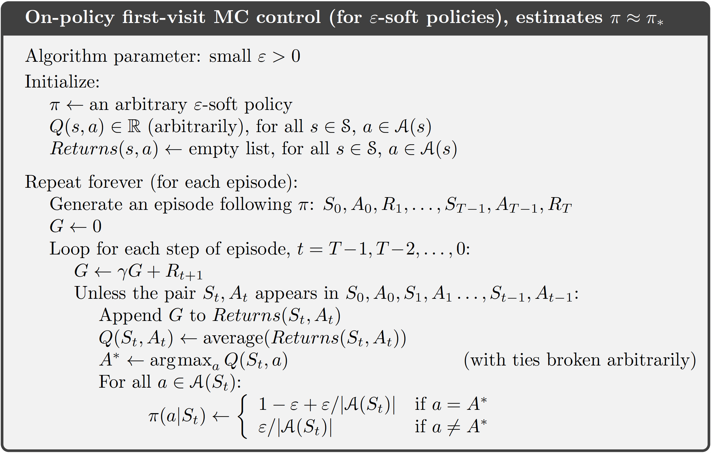

## Monte Carlo Control without Exploring Starts

How can we avoid the unlikely assumption of exploring starts? The only general way to ensure that all actions are selected infinitely often is for the agent to continue to select them. There are two approaches to ensuring this, resulting in what we call on-policy methods and off-policy methods. On-policy methods attempt to evaluate or improve the policy that is used to make decisions, whereas off-policy methods evaluate or improve a policy different from that used to generate the data. The Monte Carlo ES method developed above is an example of an on-policy method. In this section we show how an on-policy Monte Carlo control method can be designed that does not use the unrealistic assumption of exploring starts.

In on-policy control methods, the policy is generally soft, meaning that $\pi(a|s)>0$ for all $s \in S$ and all $a \in A(s)$ , but gradually shifted closer and closer to a deterministic optimal policy. The on-policy method we present in this section uses $\epsilon$-greedy policies, meaning that most of the time they choose an action that has maximal estimated action value, but with probability $\epsilon$ they instead select an action at random. That is, all nongreedy actions are given the minimal probability of selection $\epsilon\over{|A(s)|}$, and the remaining bulk ofthe probability, $1-\epsilon + {\epsilon\over{|A(s)|}}$ , is given to the greedy action. The $\epsilon$-greedy policies are examples of $\epsilon$-soft policies, defined as policies for which $\pi(a|s)\geq {\epsilon\over{|A(s)|}}$
for all states and actions, for some $\epsilon$ > 0. Among $\epsilon$-soft policies, $\epsilon$-greedy policies are in some sense those that are closest to greedy. 

The overall idea of on-policy Monte Carlo control is still that of GPI. As in Monte Carlo ES, we use first-visit MC methods to estimate the action-value function for the current policy. Without the assumption of exploring starts, however, we cannot simply improve the policy by making it greedy with respect to the current value function, because that would prevent further exploration of nongreedy actions. Fortunately, GPI does not require that the policy be taken all the way to a greedy policy, only that it be moved toward a greedy policy. In our on-policy method we will move it only to an $\epsilon$-greedy policy. For any $\epsilon$-soft policy, $\pi$, any $\epsilon$-greedy policy with respect to $q_{\pi}$ is guaranteed to be better than or equal to $\pi$. The complete algorithm is given in the box below.




```python
import random
from collections import defaultdict
import numpy as np

class OnPolicyFirstVisitMC:
    def __init__(self, env, gamma=1.0, epsilon=0.1):
        self.env = env
        self.gamma = gamma
        self.epsilon = epsilon
        self.Q = defaultdict(lambda: np.zeros(env.action_space.n))
        self.returns = defaultdict(lambda: defaultdict(list))  # returns[state][action] = []
        self.policy = defaultdict(lambda: np.ones(env.action_space.n) / env.action_space.n)

    def generate_episode(self):
        episode = []
        state = self.env.reset()
        done = False

        while not done:
            action_probs = self.policy[state]
            action = np.random.choice(np.arange(len(action_probs)), p=action_probs)
            next_state, reward, done, _ = self.env.step(action)
            episode.append((state, action, reward))
            state = next_state

        return episode

    def first_visit_check(self, episode, state, action, idx):
        return (state, action) not in [(s, a) for (s, a, _) in episode[:idx]]

    def update_policy(self, state):
        best_action = np.argmax(self.Q[state])
        n_actions = self.env.action_space.n
        for a in range(n_actions):
            if a == best_action:
                self.policy[state][a] = 1 - self.epsilon + self.epsilon / n_actions
            else:
                self.policy[state][a] = self.epsilon / n_actions

    def train(self, episodes=10000):
        for _ in range(episodes):
            episode = self.generate_episode()

            G = 0
            visited = set()

            for t in reversed(range(len(episode))):
                state, action, reward = episode[t]
                G = self.gamma * G + reward

                if (state, action) not in visited:
                    self.returns[state][action].append(G)
                    self.Q[state][action] = np.mean(self.returns[state][action])
                    self.update_policy(state)
                    visited.add((state, action))

    def get_policy(self):
        return self.policy

    def get_q(self):
        return self.Q
```

