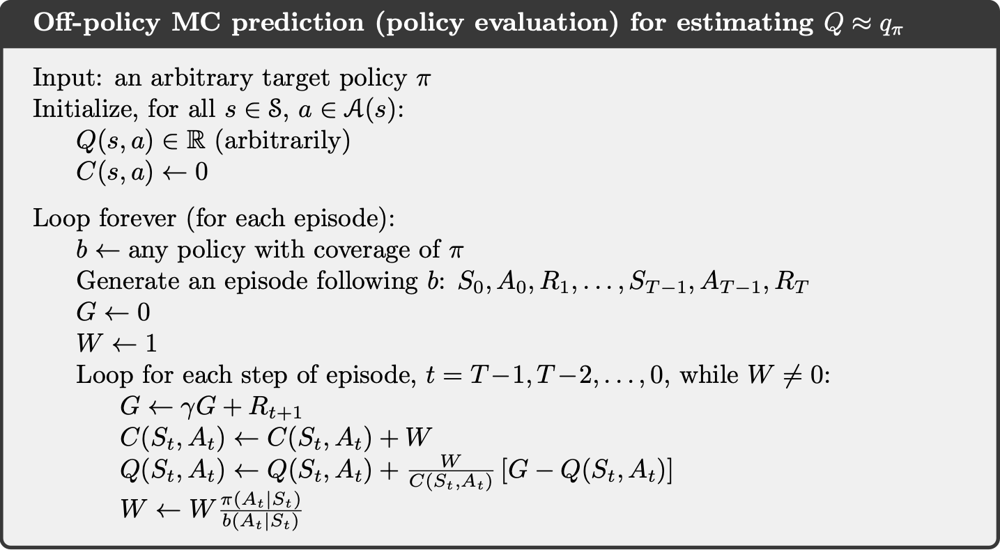
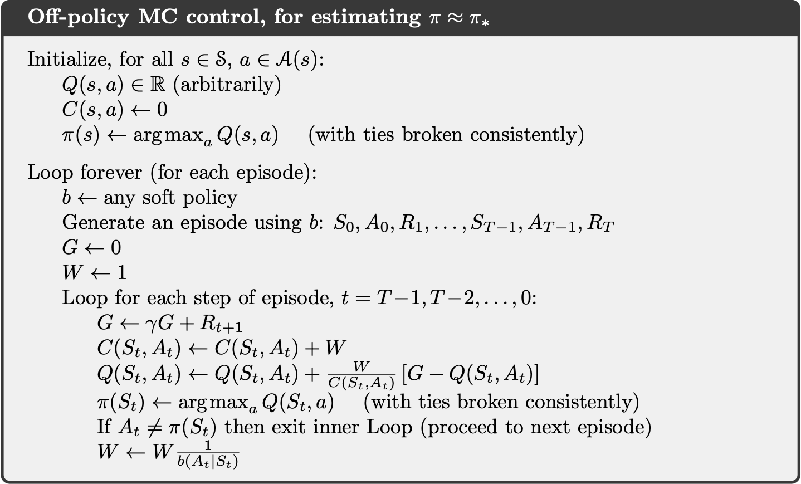

## Policy Prediction via Importance Sampling

All learning control methods face a dilemma: They seek to learn action values conditional on subsequent optimal behavior, but they need to behave non-optimally in order to explore all actions (to find the optimal actions). How can they learn about the optimal policy while behaving according to an exploratory policy? The on-policy approach is actually a compromise—it learns action values not for the optimal policy, but for a near-optimal policy that still explores. A more straightforward approach is to use two policies:

- **target policy:** is learned about and that becomes the optimal policy
- **behavior policy:** is more exploratory and is used to generate behavior.

In this case we say that learning is from data “off” the target policy, and the overall process is termed **off-policy learning**. On-policy methods are generally simpler and are considered first. Off-policy methods require additional concepts and notation, and because the data is due to a different policy, off-policy methods are often of greater variance and are slower to converge. On the other hand, off-policy methods are more powerful and general. They include on-policy methods as the special case in which the target and behavior policies are the same. Off-policy methods also have a variety of additional uses in applications. For example, they can often be applied to learn from data generated by a conventional non-learning controller, or from a human expert.

In this section we begin the study of off-policy methods by considering the prediction problem, in which both target and behavior policies are fixed. That is, suppose we wish to estimate $v_{\pi}$ or $q_{\pi}$ , but all we have are episodes following another policy $b$, where $b \neq \pi$. In this case, $\pi$is the target policy, $b$ is the behavior policy, and both policies are considered fixed and given. In order to use episodes from $b$ to estimate values for $\pi$, we require that every action taken under $\pi$ is also taken, at least occasionally, under $b$. That is, we require that $\pi(a|s) > 0$ implies $b(a|s) > 0$. This is called the assumption of coverage. It follows from coverage that $b$ must be stochastic in states where it is not identical to $\pi$. The target policy $\pi$, on the other hand, may be deterministic, and, in fact, this is a case of particular interest in control applications. In control, the target policy is typically the deterministic greedy policy with respect to the current estimate of the action-value function. This policy becomes a deterministic optimal policy while the behavior policy remains stochastic and more exploratory, for example, an "$\epsilon$-greedy policy. In this section, however, we consider the prediction problem, in which $\pi$ is unchanging and given. Almost all off-policy methods utilize importance sampling, a general technique for estimating expected values under one distribution given samples from another. We apply importance sampling to off-policy learning by weighting returns according to the relative probability of their trajectories occurring under the target and behavior policies, called the importance-sampling ratio. Given a starting state $S_t$, the probability of the subsequent state–action trajectory, $A_t, S_{t+1}, A_{t+1}, ..., S_T$, occurring under any policy $\pi$ is:

$$
Pr[A_t, S_{t+1}, A_{t+1}, ..., S_T | S_t, A_{t:T-1} \sim \pi]= \pi(A_t) p(S_{t+1}|S_t, A_t)\pi(A_{t+1})p(S_{t+2}|S_{t+1}, A_{t+1})...p(S_T|S_{T-1}, A_{T-1})= \prod_{k=t}^{T-1} \pi(A_k|S_k)p(S_{k+1}|S_k,A_k)
$$

Thus, the relative probability of the trajectory under the target and behavior policies (the importance-sampling ratio) is:

$$
\rho_{t:T-1}\doteq\frac{\prod_{k=t}^{T-1}\pi(A_k\mid S_k)\,p(S_{k+1}\mid S_k,A_k)}{\prod_{k=t}^{T-1}b(A_k\mid S_k)\,p(S_{k+1}\mid S_k,A_k)}=\prod_{k=t}^{T-1}\frac{\pi(A_k\mid S_k)}{b(A_k\mid S_k)}
$$

we wish to estimate the expected returns (values) under the target policy, but all we have are returns $G_t$ due to the behavior policy. These returns have the wrong expectation $\mathbb{E}[G_t|S_t=s]=v_b(s)$and so cannot be averaged to obtain $v_\pi$ . This is where importance sampling comes in. The ratio $\rho_{t:T-1}$ transforms the returns to have the right expected value: $\mathbb{E}[\rho_{t:T-1} G_t|S_t=s]=v_\pi(s)$

It is convenient here to number time steps in a way that increases across episode boundaries. That is, if the first episode of the batch ends in a terminal state at time 100, then the next episode begins at time t = 101. This enables us to use time-step numbers to refer to particular steps in particular episodes. In particular, we can define the set of all time steps in which state s is visited, denoted $\tau(s)$. This is for an every visit method; for a first-visit method, $\tau(s)$ would only include time steps that were first visits to s within their episodes. Also, let $T(t)$ denote the first time of termination following time $t$, and $G_t$ denote the return after $t$ up through $T(t)$. Then $\{G_t\}_{t\in\tau(s)}$ are the returns that pertain to state $s$, and $\{\rho_{t:T-1}\}_{t\in\tau(s)}$ are the corresponding importance-sampling ratios. To estimate $v_{\pi}(s)$, we simply scale the returns by the ratios and average the results:

$$
V(s)\doteq\frac{\sum_{t\in\mathcal{T}(s)}\rho_{t:T(t)-1}G_t}{\left|\mathcal{T}(s)\right|}
$$

When importance sampling is done as a simple average in this way it is called ordinary importance sampling.
An important alternative is weighted importance sampling, which uses a weighted average, defined as:

$$
V(s)\doteq\frac{\sum_{t\in\mathcal{T}(s)}\rho_{t:T(t)-1}G_t}{ \sum_{t\in\mathcal{T}(s)}\rho_{t:T(t)-1}}
$$

To understand these two varieties of importance sampling, consider the estimates of their first-visit methods after observing a single return from state $s$. In the weighted-average estimate, the ratio $\rho_{t:T(t)-1}$ for the single return cancels in the numerator and denominator, so that the estimate is equal to the observed return independent of the ratio (assuming the ratio is nonzero). Given that this return was the only one observed, this is a reasonable estimate, but its expectation is $v_b(s)$ rather than $v_\pi(s)$, and in this statistical sense it is biased. In contrast, the first-visit version of the ordinary importance-sampling estimator is always $v_{\pi}(s)$ in expectation (it is unbiased), but it can be extreme. Suppose the ratio were ten, indicating that the trajectory observed is ten times as likely under the target policy as under the behavior policy. In this case the ordinary importance-sampling estimate would be ten times the observed return. That is, it would be quite far from the observed return even though the episode’s trajectory is considered very representative of the target policy. Formally, the difference between the first-visit methods of the two kinds of importance sampling is expressed in their biases and variances. Ordinary importance sampling is unbiased whereas weighted importance sampling is biased (though the bias converges asymptotically to zero). On the other hand, the variance of ordinary importance sampling is in general unbounded because the variance of the ratios can be unbounded, whereas in the weighted estimator the largest weight on any single return is one. In fact, assuming bounded returns, the variance of the weighted importance-sampling estimator converges to zero even if the variance of the ratios themselves is infinite (Precup, Sutton, and Dasgupta 2001). **In practice, the weighted estimator usually has dramatically lower variance and is strongly preferred**. Nevertheless, we will not totally abandon ordinary importance sampling as it is easier to extend to the approximate methods using function approximation that we explore in the second part of this book. The every-visit methods for ordinary and weighed importance sampling are both biased, though, again, the bias falls asymptotically to zero as the number of samples increases. **In practice, every-visit methods are often preferred** because they remove the need to keep track of which states have been visited and because they are much easier to extend to approximations.

## Incremental Implementation

Monte Carlo prediction methods can be implemented incrementally, on an episode-by-episode basis by averaging returns. For off-policy Monte Carlo methods, we need to separately consider importance sampling.

Suppose we have a sequence of returns $G_1, G_2, ..., G_{n-1}$, all starting in the same state and each with a corresponding random weight $W_i$ (e.g.,$W_i=\rho_{t_i:T(t_i)-1}$ ). We wish to form the estimate:

$$
V\doteq\frac{\sum_{k=1}^{n-1}W_kG_k}{\sum_{k=1}^{n-1}W_k},\quad n\ge2
$$

and keep it up-to-date as we obtain a single additional return $G_n$. In addition to keeping track of $V_n$, we must maintain for each state the cumulative sum $C_N$ of the weights given to the first n returns. The update rule for $V_N$ is:

$$
V_{n+1}\doteq V_n+\frac{W_n}{C_n}[G_n- V_n], \quad n\ge1
$$

and

$$
C_{n+1}\doteq C_n + W_{n+1}
$$

where $C_0 \doteq0$ (and $V_1$ is arbitrary and thus need not be specified). Below, complete episode-by-episode incremental algorithm for Monte Carlo policy evaluation for the off-policy case, using weighted importance sampling, but applies as well to the on-policy case just by choosing the target and behavior policies as the same (in which case ( $\pi=b$ ), $W$ is always 1). The approximation $Q$ converges to $q_\pi$ (for all encountered state–action pairs) while actions are selected according to a potentially different policy, $b$.

## Off-policy Monte Carlo Control

The second class of learning control methods: off-policy methods. The policy used to generate behavior, called the behavior policy, may in fact be unrelated to the policy that is evaluated and improved, called the target policy. An advantage of this separation is that the target policy may be deterministic (e.g., greedy), while the behavior policy can continue to sample all possible actions. Off-policy Monte Carlo control methods use one of the techniques presented in the preceding two sections. They follow the behavior policy while learning about and improving the target policy. These techniques require that the behavior policy has a nonzero probability of selecting all actions that might be selected by the target policy (coverage). To explore all possibilities, we require that the behavior policy be soft (i.e., that it select all actions in all states with nonzero probability). Below, off-policy Monte Carlo control method, based on GPI and weighted importance sampling, for estimating $\pi_*$ and $q_*$. The target policy $\pi\approx\pi_*$ is the greedy policy with respect to $Q$, which is an estimate of $q_\pi$ . The behavior policy $b$ can be anything, but in order to assure convergence of $\pi$ to the optimal policy, an infinite number of returns must be obtained for each pair of state and action. This can be assured by choosing b to be "$\epsilon$-soft. The policy $\pi$ converges to optimal at all encountered states even though actions are selected according to a different soft policy $b$, which may change between or even within episodes.

